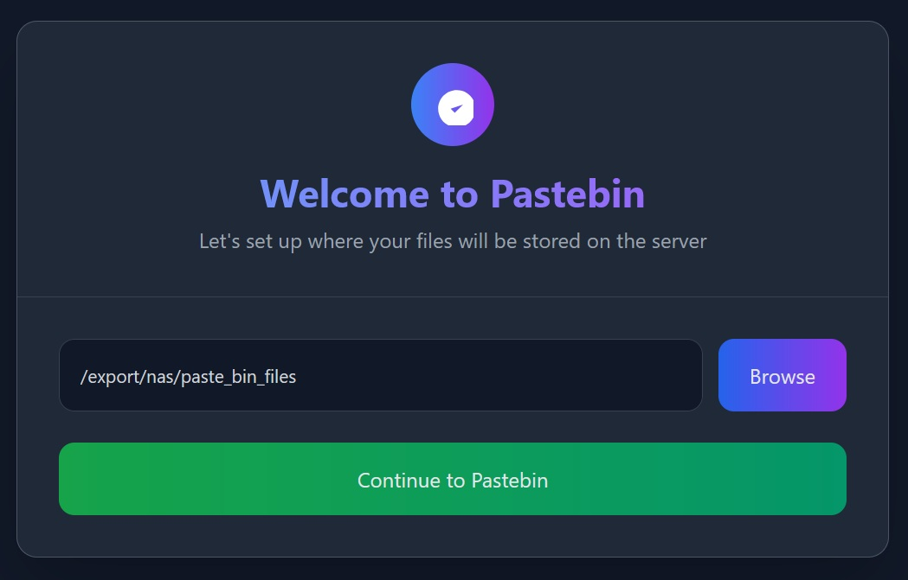
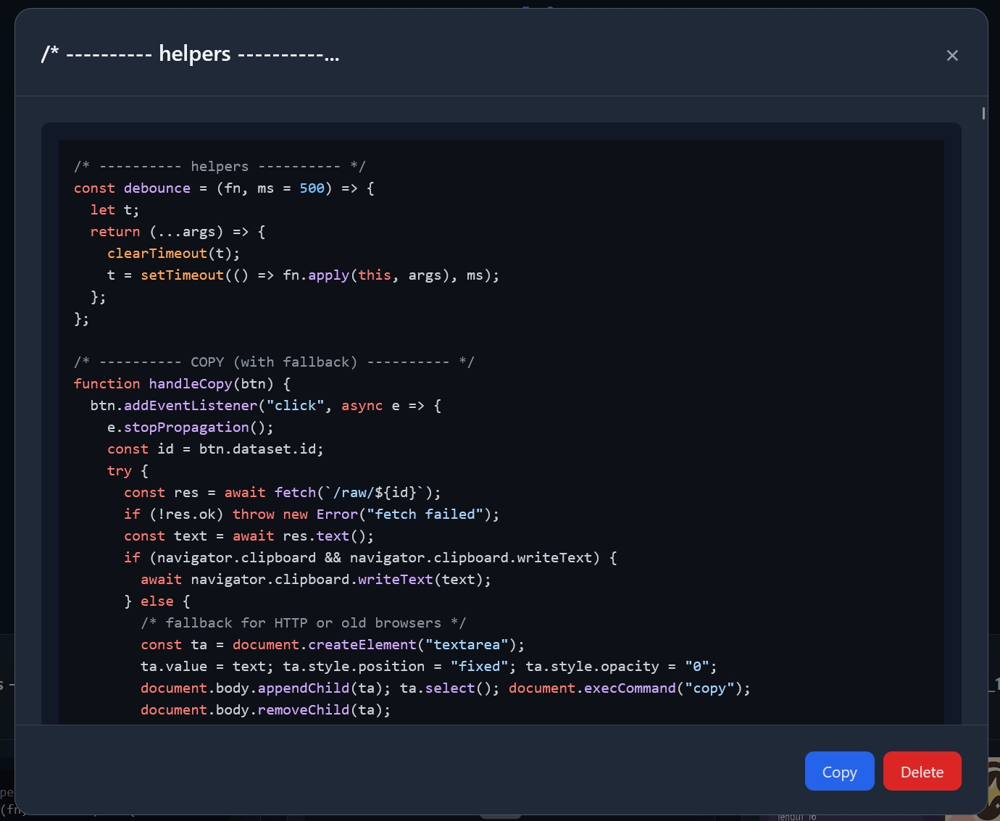

# Pastebin

A modern, self-hosted pastebin application built with Flask and Tailwind CSS. Share text snippets and files with syntax highlighting, bulk operations, file system monitoring, and a responsive design.

## Features

- **Text & File Sharing** - Share code snippets, text, and upload multiple files
- **Drag & Drop** - Easy file uploads with progress tracking
- **Syntax Highlighting** - Automatic code highlighting with language detection
- **Responsive Design** - Works seamlessly on desktop and mobile devices
- **Search & Filter** - Find pastes by content, filename, or date range
- **File Previews** - Preview images, videos, PDFs, and code files
- **Cross-Platform** - Supports Windows, Linux, and macOS with platform-specific optimizations
- **Database Maintenance** - Built-in tools for cleaning orphaned entries and checking file integrity

## Screenshots

### One-Step Setup


The application features a simple one-step setup where you choose where to store uploaded files.

### Application Overview


Clean, modern interface with card-based layout, search functionality, and bulk operations.

### Syntax Highlighting


Automatic syntax highlighting for code files with language detection and modal previews.


## Installation

1. **Clone the repository**
   ```bash
   git clone https://github.com/MIKKELLORENZ/pastebin
   cd pastebin
   ```

2. **Install dependencies**
   ```bash
   pip install -r requirements.txt
   ```
   
   Or install manually:
   ```bash
   pip install Flask==2.3.3 Werkzeug==2.3.7 watchdog==3.0.0
   ```

3. **Run the application**
   ```bash
   python app.py
   ```

4. **Access the application**
   Open your browser and navigate to `http://localhost:8000`

## First-Time Setup

On first launch, you'll be guided through a simple setup process to choose your upload directory. The application will:

- Present a cross-platform directory browser
- Allow you to navigate the entire file system
- Validate write permissions for selected directories
- Handle Windows drives and Unix-style paths appropriately
- Configure the database and initialize file system monitoring
- Redirect you to the main interface

The setup process works on all platforms:
- **Windows**: Browse available drives (C:, D:, etc.) and navigate folders
- **Linux/macOS**: Start from root (/) and navigate the file system
- **All platforms**: Type paths directly or use the visual browser

## Usage

### Creating Pastes
- **Text**: Simply paste or type content into the text area
- **Files**: Use the file input or drag and drop files onto the interface
- **Mixed**: Upload files with accompanying text descriptions
- **Progress Tracking**: Real-time upload progress with file size information

### Managing Pastes
- **View**: Click on any paste card to open a detailed modal
- **Copy**: Use the copy button to copy text content to clipboard
- **Download**: Download individual files or bulk download multiple items
- **Delete**: Remove individual pastes or bulk delete selected items
- **Search**: Use the search bar to find pastes by content or filename
- **Filter**: Use the date range picker to filter by creation date

### Bulk Operations
- Select multiple pastes using the checkboxes
- Perform bulk downloads (creates a ZIP file)
- Bulk delete with confirmation modal requiring "DELETE" confirmation
- Clear selection or expand to see selected items list

### Settings & Maintenance
- **Change Upload Directory**: Use the hamburger menu to access settings
- **File System Monitoring**: Automatic detection and cleanup of deleted files
- **Database Cleanup**: Manual cleanup of orphaned database entries
- **File Migration**: Automatic migration when changing upload directories
- **Cross-Platform Paths**: Proper handling of Windows and Unix path formats

## File Support

The application supports various file types with appropriate previews:

- **Images**: JPG, PNG, GIF, WebP, BMP, SVG with thumbnail previews
- **Videos**: MP4, WebM, MOV, AVI, MKV with video player icons
- **Audio**: MP3, WAV, OGG, AAC, FLAC with audio file icons
- **Documents**: PDF, DOC, XLS, PPT files with document type icons
- **Code**: Automatic syntax highlighting for programming languages
- **Text**: Plain text, Markdown, logs, configuration files

## Configuration

### Storage Location
Access settings through the hamburger menu to:
- Browse and select new upload directories with full filesystem access
- Validate directory permissions before changing
- Automatically migrate existing files to new locations
- Handle cross-platform path differences

### File System Monitoring
The application includes built-in monitoring that:
- Watches the upload directory for external file deletions
- Automatically removes database entries for deleted files
- Provides manual cleanup tools for maintenance
- Logs all file system events for debugging

### Database Management
- **SQLite Database**: Automatic schema creation and migration
- **Orphaned Entry Cleanup**: Remove entries for missing files
- **File Integrity Checks**: Verify all database entries have corresponding files
- **Settings Storage**: Persistent storage of configuration in database

## Technical Details

- **Backend**: Flask 2.3.3 (Python)
- **Database**: SQLite with automatic schema management
- **Frontend**: Vanilla JavaScript with Tailwind CSS
- **File Monitoring**: Watchdog library for cross-platform file system events
- **File Handling**: Secure filename handling with timestamp prefixes
- **Syntax Highlighting**: Highlight.js with automatic language detection
- **Date Handling**: Flatpickr for responsive date range selection
- **File Uploads**: Progress tracking with file size validation

## System Requirements

- **Python**: 3.7 or higher
- **Operating System**: Windows, Linux, or macOS
- **Disk Space**: Varies based on uploaded content
- **Permissions**: Write access to chosen upload directory
- **Browser**: Modern browser with JavaScript enabled

## Security Features

- **Secure Filenames**: Werkzeug secure_filename for safe file handling
- **Path Validation**: Proper path sanitization and validation
- **Permission Checks**: Directory write permission verification
- **File System Isolation**: Contained file operations within configured directory

## Browser Support

- Modern browsers with JavaScript enabled
- Mobile-responsive design with touch-friendly interfaces
- Progressive enhancement for older browsers
- Cross-platform file drag and drop support

## License

Open source - feel free to modify and distribute according to your needs.

## Contributing

Contributions are welcome! Please feel free to submit issues and pull requests.

## Troubleshooting

### Common Issues

1. **Permission Denied**: Ensure the selected upload directory has write permissions
2. **File Not Found**: Use the cleanup tool in settings to remove orphaned database entries
3. **Setup Loop**: Clear browser cache if redirected back to setup repeatedly
4. **File Upload Fails**: Check available disk space and file permissions

### Maintenance

- Use the built-in cleanup tool in settings for database maintenance
- Monitor application logs for file system events
- Regularly check file integrity using the admin tools
- Consider periodic backups of both files and the SQLite database
